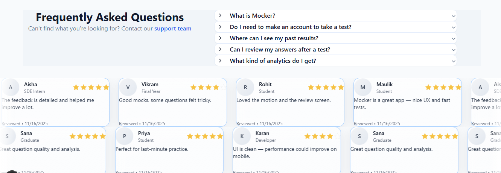

# Mocker — Exam Mock Test Platform  
Mocker is a smart, exam-focused platform that helps you practice with realistic mock tests, track performance with detailed analytics, and improve faster through targeted insights. Built for serious prep — simple, fast, and focused on results.

[](https://mocker-mg.vercel.app/)
---

## 🛠️ Tech Stack

This project is built with a modern, full-stack tech stack:


<!--  -->


---

## 🚀 Features

### 🎯 **1. Mock Tests (CAT, GATE, TECH)**  
- CAT & GATE fully implemented  
- TECH category modular and extendable  
- Each mock contains:
  - Sections  
  - Duration  
  - Questions with marking scheme  
  - Multiple correct / incorrect / unattempted tracking  

---

### 🔐 **2. Authentication (Clerk)**
- Secure login using Clerk  
- Supports email, passwordless, OAuth (if enabled)  
- User-specific dashboard & analytics  

---

### 🧮 **3. Realistic Exam Engine**
- Full-screen mode  
- Escape/tab switching detection  
- Violation counter  
- Auto-submit after 3 violations  
- Exam timer  
- Question palette (visited, answered, marked for review)  
- Clear, next, previous, mark-for-review actions  

---

### 📊 **4. Detailed Analytics**
- Dashboard analytics for **all completed tests**  
- Individual exam analytics with:  
  - Accuracy  
  - Percentage  
  - Correct / Wrong / Unattempted  
  - Time taken  
  - Pie chart (distribution)  
  - Line chart (performance over time)  
- Stored using Prisma + PlanetScale/Vercel DB  

---

### 🗂 **5. Review Answers**
- After submission, user can review each question  
- Highlights:
  - Correct answer  
  - User answer  
  - Explanation (if included)  
  - Visual styling for correct/incorrect  

---

### ⭐ **6. Scrolling Reviews Component**
- Horizontal auto-scrolling user testimonials  
- Alternating direction (left/right) per row  
- Pauses on hover without resetting position  
- Smooth, modern feel using Framer Motion  

---

### 🎨 **7. Clean UI (Next.js + Tailwind CSS)**
Includes professionally designed pages:

- Landing / Home  
- Mocks listing  
- Dashboard  
- Instructions  
- Exam  
- Results  
- Review  
- Meet the Team  
- Terms & Conditions  
- Privacy Policy  
- Footer with branding  

---

## 📸 Screenshots


### Dashboard


### Exam Screen


### Results


### Reviews Carousel


---

## 🏗 Project Structure

```bash
app/
 ├── (main)/
 │   ├── dashboard/page.tsx
 │   ├── mocks/page.tsx
 │   └── review/
 │        ├── layout.tsx
 │        └── page.tsx
 │
 ├── (routes)/
 │   ├── _components/
 │   │     ├── CategoryFilter.tsx
 │   │     ├── FAQ.tsx
 │   │     ├── Footer.tsx
 │   │     ├── NavBar.tsx
 │   │     ├── PieChart.tsx
 │   │     ├── PerformanceLineChart.tsx
 │   │     └── StatCard.tsx
 │   ├── exam/page.tsx
 │   ├── instructions/page.tsx
 │   ├── privacy-policy/page.tsx
 │   ├── results/page.tsx
 │   └── team/page.tsx
 │
 ├── actions/
 ├── assets/
 ├── components/
 │   ├── exam/ExamProctor.tsx
 │   ├── layout/
 │   ├── test/
 │   └── ui/
 │        ├── accordion.tsx
 │        ├── glowing-effect.tsx
 │        ├── ReviewCard.tsx
 │        ├── ScrollingReviews.tsx
 │        ├── text-generate-effect.tsx
 │        ├── VantaLines.tsx
 │        └── VantaWaves.tsx
 │
 ├── context/ExamContext.tsx
 │
 ├── data/
 │   ├── pyp/
 │   ├── cat/
 │   ├── gate/
 │   └── tech/
 │
 ├── prisma/
 │   ├── schema.prisma
 │   └── migrations/
 │
 ├── lib/
 ├── node_modules/
 ├── globals.css
 └── layout.tsx

```
---
## 🏃‍♂️ Running Locally

Follow these steps to run **Mocker** on your local machine:

---

### 1️⃣ Clone the repository

```bash
git clone https://github.com/YOUR_USERNAME/mocker.git
cd mocker
```
2. Install dependencies
```
npm install
# or
yarn install
```
3. Create an environment file

Create .env.local in the root:
```
# Clerk Authentication
NEXT_PUBLIC_CLERK_PUBLISHABLE_KEY=your_clerk_publishable_key
CLERK_SECRET_KEY=your_clerk_secret_key

# Prisma Database (Vercel / PlanetScale)
DATABASE_URL=your_database_url
```
4. Push the Prisma schema
```
npx prisma db push
```
5. Run the development server
```
npm run dev
```
Now open http://localhost:3000

---
👤 Author

Maulik

Thanks for checking this out!

Feel free to connect anytime.